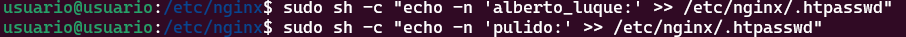
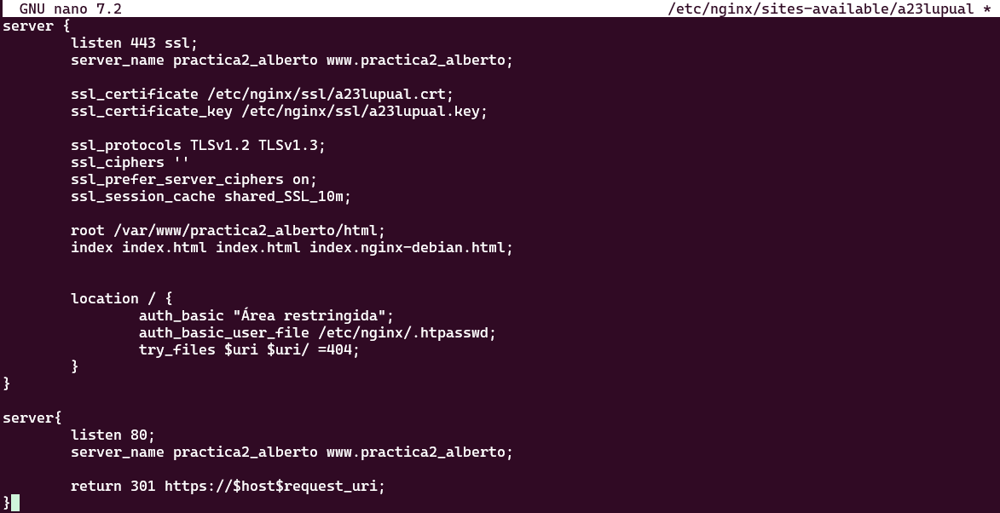
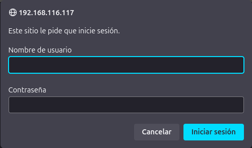
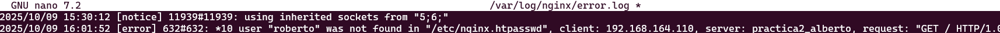
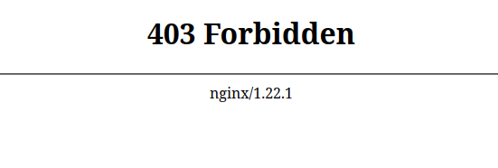

# Práctica 2.2 – Autenticación en Nginx

## Introducción

En una transacción HTTP, la autenticación de acceso básica es un método que permite a un navegador web u otro cliente proporcionar credenciales, como un nombre de usuario y una contraseña, al solicitar una página al servidor.

Como su nombre lo indica, la autenticación básica es el método más simple disponible para aplicaciones web. Fue definida originalmente en la especificación del protocolo HTTP y, aunque no es sofisticada, cumple su propósito.

Sin embargo, este tipo de autenticación presenta importantes vulnerabilidades de seguridad, lo que la hace poco recomendable en muchas situaciones. No requiere el uso de cookies, identificadores de sesión ni páginas de inicio de sesión.

## Paquetes necesarios

Para esta práctica vamos a necesitar openssl para la creación de las claves.

En caso de no tenerlo instalado esté es el comando.

``sudo apt install openssl``

## Creación de usuarios y constraseñas para el acceso web

Para la creación de usuarios y contraseñas necesitaremos crear un archivo oculto llamado ".htpasswd" en el directorio de configuración /etc/nginx donde guardaremos nuestros usuarios y contraseñas.

Vamos a crear dos usuarios:

Para esto nos conectaremos a nuestra máquina a través de una conexión ssh:

Para después crear los usuarios con el comando ``sudo sh -c "echo -n 'vuestro_nombre:' >> /etc/nginx/.htpasswd"``:

Y así se crea la constraseña:

## Configurando el servidor Nginx para usar autenticación básica

Para configurar el servidor Nginx para usar autenticación básica editaremos la configuración del server block sobre el cual queremos aplicar la restricción de acceso:

Para esto usaremos nano: ``sudo nano /etc/nginx/sites-available/nombre_web``

Lo primero será decidir qué recursos estarán protegidos. Nginx permite añadir restricciones a nivel de servidor o en un location (directorio o archivo) específico. Para nuestro ejemplo inicial vamos a proteger la raíz, la página principal de nuestro sitio.

Utilizaremos la directiva auth_basic dentro del location y le pondremos el nombre a nuestro dominio que será mostrado al usuario al solicitar las credenciales. Por último, configuramos Nginx para que utilice el fichero que previamente hemos creado con la directiva auth_basic_user_file : 

``
location / {
    auth_basic  "Área restringida";
    auth_basic_user_file    /etc/nginx/.htpasswd;
        try_files $uri $uri/ =404;
}
``

Deberiamos acabar con un archivo parecido a este:

Una vez terminada la configuración deberemos reiniciar el servicio:

``sudo systemctl restart nginx.service``

## Probando la nueva configuración

Para esto desde la máquina física abriremos el navegador y bucamos ``http://nombre-sitio-web``:

## Combinación de la autenticación básica con la restricción de acceso por IP

Ha dos formas de integrar autenticación básica, ya sea por un usuario autenticado y tener IP válida o que el usuario estar bien autenticado o tener una ip válida.

#### Como permitir o denegar acceso sobre una IP concreta.

Esto lo conseguiremos con las directivas ``allow`` y ``deny``:

`location /api {
    deny 192.168.1.2;
    allow 192.168.1.1/24;
    allow 127.0.0.1;
    deny all;
}`

El acceso se garantizará a la IP 192.168.1.1/24, excluyendo a la dirección 192.168.1.2.

Hay que tener en cuenta que las directivas allow y deny se irán aplicando en el orden en el que aparecen el archivo.

Aquí aplican sobre la location /api (esto es solo un ejemplo de un hipotético directorio o archivo), pero podrían aplicar sobre cualquiera, incluida todo el sitio web, la location raíz /.

La última directiva deny all quiere decir que por defecto denegaremos el acceso a todo el mundo. Por eso hay que poner los allow y deny más específicos justo antes de esta, porque al evaluarse en orden de aparición, si los pusiéramos debajo se denegaría el acceso a todo el mundo, puesto que deny all sería lo primero que se evaluaría.

Combinar la restricción IP y la autenticación HTTP con la directiva satisfy.

Si establecemos el valor de la directiva a “all”, el acceso se permite si el cliente satisface ambas condiciones (IP y usuario válido). Si lo establecemos a “any”, el acceso se permite si se satisface al menos una de las dos condiciones.

`
location/api{
    satisfy all;
    deny 192.168.1.2;
    allow 192.168.1.1/24;
    allow 127.0.0.1;
    deny all;
    auth_basic  "Administrator's Area';
    auth_basic_usr_file conf/htpasswd;
}
`

## Tareas

### 1.  Intenta entrar primero con un usuario erróneo y luego con otro correcto. Puedes ver       todos los sucesos y registros en los logs access.log y error.log

    Adjunta una captura de pantalla de los logs donde se vea que intentas entrar primero con un usuario inválido y con otro válido. Indica dónde podemos ver los errores de usuario inválido o no encontrado, así como donde podemos ver el número de error que os aparecía antes

Vamos a intentar acceder con usuario que no existe como es 'Roberto' y luego vamos a comprobar el error en el log.

### 2.  Borra las dos líneas que hacen referencia a la autenticación básica en el location del directorio raíz. Tras ello, añade un nuevo location debajo con la autenticación básica para el archivo/sección contact.html únicamente.

Para esto tendremos que borrar las dos lineas que hacer referencia a la autenticación básica en el directorio raiz. Luego añadiremos un nuevo location:

`location /contact.html {
    auth_basic  "Área restringida";
    auth_basic_user_file    /etc/nginx/.htpasswd;
}`

### 3. Configura Nginx para que no deje acceder con la IP de la máquina anfitriona al directorio raíz de una de tus dos webs. Modifica su server block o archivo de configuración. Comprueba como se deniega el acceso: 

Para denegarle el acceso a nuestra máquina anfitriona simplemente tendremos que añadir la directiva deny como hemos visto antes con la ip de las misma en mi caso `192.168.164.110`, quedando así:

`location / {
    deny 192.168.164.110/24;
    try_files $uri $uri/ =404;
}`

Tras este cambio nos deberria aparecer esta página en el navegador:

### 4. Configura Nginx para que desde tu máquina anfitriona se tenga que tener tanto una IP válida como un usuario válido, ambas cosas a la vez, y comprueba que sí puede acceder sin problemas

Para conseguir esto tendremos que añadir las direcctivas allow <IP_MAQUINA> deny <all> para que así solo permita acceder a nuestra máquina. Quedaria de la siguiente manera:

`
location / {
    satisfy all;
    allow 192.168.164.110/24;
    deny all;
    auth_basic  "Área restringida";
    auth_basic_user_file    /etc/nginx/.htpasswd;
    try_files $uri $uri/ =404;
}
`

# Cuestiones finales

1. Cuestion 1:

- Supongamos que yo soy el cliente con la IP 172.1.10.15 e intento acceder al directorio web_muy_guay de mi sitio web, equivocándome al poner el usuario y contraseña. ¿Podré acceder?¿Por qué?

`
location /web_muy_guay {
    #...
    satisfy all;    
    deny  172.1.10.6;
    allow 172.1.10.15;
    allow 172.1.3.14;
    deny  all;
    auth_basic "Cuestión final 1";
    auth_basic_user_file conf/htpasswd;
}
`

No podrás acceder ya que aún habiendo una directiva que permite acceso a esa ip (`allow 172.1.10.15`), te has equivocado en la autenticación y esto te deniega el acceso con la directiva (`satisfy all`).

2. Cuestion 2:

Supongamos que yo soy el cliente con la IP 172.1.10.15 e intento acceder al directorio web_muy_guay de mi sitio web, introduciendo correctamente usuario y contraseña. ¿Podré acceder? ¿Por qué?

`
location /web_muy_guay {
    #...
    satisfy all;    
    deny  all;
    deny  172.1.10.6;
    allow 172.1.10.15;
    allow 172.1.3.14;
    auth_basic "Cuestión final 2: The revenge";
    auth_basic_user_file conf/htpasswd;
}
`

No podrás acceder ya que tu IP está denegado por una directiva.

3. Cuestion 3:

Supongamos que yo soy el cliente con la IP 172.1.10.15 e intento acceder al directorio web_muy_guay de mi sitio web, introduciendo correctamente usuario y contraseña. ¿Podré acceder? ¿Por qué?

`
location /web_muy_guay {
    #...
    satisfy any;    
    deny  172.1.10.6;
    deny 172.1.10.15;
    allow 172.1.3.14;
    auth_basic "Cuestión final 3: The final combat";
    auth_basic_user_file conf/htpasswd;
}
`

Si prodrás acceder ya que a pesar de que tu IP está denegada aparece la directiva ``satify any`` entonces cumplirias los requisitos.

4. Cuestion 4:

A lo mejor no sabéis que tengo una web para documentar todas mis excursiones espaciales con Jeff, es esta: Jeff Bezos y yo

Supongamos que quiero restringir el acceso al directorio de proyectos porque es muy secreto, eso quiere decir añadir autenticación básica a la URL:Proyectos

Completa la configuración para conseguirlo:

`
server {
listen 80;
listen [::]:80;
root /var/www/freewebsitetemplates.com/preview/space-science;
index index.html index.htm index.nginx-debian.html;
server_name freewebsitetemplates.com www.freewebsitetemplates.com;
location              {
    try_files $uri $uri/ =404;
    }
}
`

Para eso añadiremos configuraremos un nuevo location para ello:

`
    server {
    listen 80;
    listen [::]:80;
    root /var/www/freewebsitetemplates.com/preview/space-science;
    index index.html index.htm index.nginx-debian.html;
    server_name freewebsitetemplates.com www.freewebsitetemplates.com;
    location  / {
        try_files $uri $uri/ =404;
        }
    location /project.html {
        satisfy all;
        allow 192.168.164.110/24;
        deny all;
        auth_basic  "Área restringida";
        auth_basic_user_file    /etc/nginx/.htpasswd;
        }
    }
`

