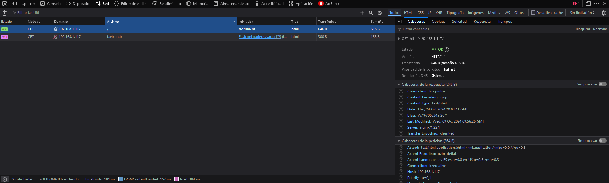
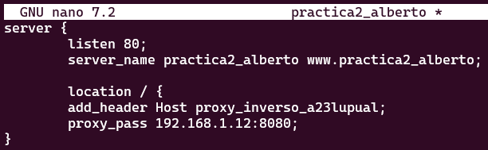

# PROXY INVERSO CON NGINX

## 1. ¿Qué es un servidor Proxy?

Un servidor Proxy es un intermediario entre el cliente y el servidor en ser un Proxy inverso, o un intermediario entre un servidor y el cliente siendo este un Proxy de reenvío.

### 1.2. Beneficios de un servidor Proxy inverso

Un servidor Proxy nos va a aportar multitud de beneficios:
    
- Con el podemos evitar restricciones de navegación estatales o institucionales: Hay ciertas instituciones o estados que no les interesa que accedamos a ciertos sitios de la red, nosotros al usar un servidor proxy y salir a la red a través de el podremos sortear dichas limitaciones.

- Bloquear acceso a ciertos sitios: De la misma forma dichas instituciones y estados usan dichos servidores para bloquear el acceso a distintos sitios, mediante filtros de contenido.

- Para proteger tu identidad en línea: Al colocar un servidor Proxy entre tu y la red, no sales a esta misma directamente si no a través del servidor; ya que al acceder a cualquier sitio web se hará con la dirección IP del servidor.

### 1.3. Beneficios de un servidor Proxy inverso

Como hemos dicho este es el servidor que se encuentra antes del servidor que desea conectarse el cliente.

- Balanceo de Carga: Si un sitio web recibe muchas peticiones este puede redireccionar peticiones y varios Proxys encargarse de entregar dichas peticiones.

- Protección contra ataques: Al igual que anteriormente el servidor o servicio no se mostrará a la red con su dirección IP si no que lo hará a través de la dirección IP del servidor Proxy que lo precede, lo que dificultará un ataque directo al mismo.

- Almacenamiento en caché: Si un recurso es muy usado no hará que un cliente acceda directamente al servidor ya que el Proxy podrá almacenar dicho recurso para poder aumentar el rendimiento.

- Cifrado SSL: El servidor Proxy también se puede configurar para el cifrado y descifrado de la información de cada cliente, esto ayuda a aliviar carga del servidor origen.

## 2. CONFIGURACIÓN DEL SERVIDOR

Para poder hacer esto necesitaremos tener dos Servidores Debian, por eso necesitaremos clonar el servidor original; uno de estos se encargará de mostrar los recursos y el otro hará las veces de Proxy.

Ahora en vez de hacer las peticiones al servidor original haremos estas al servidor proxy el cual nos redigirá al servidor.

### 2.1. Primero necesitaremos cambiar el nombre de la web por el de webserver

Esto implica:

1. Cambiar el nombre del archivo de configuración de sitios disponibles para Nginx
   

    - Cambiar el nombre del sitio web dentro de este archivo de configuracion
  

    - Y borrar el link simbólico de la carpeta sites-enabled

1. En el archivo de configuración del sitio web, en lugar de hacer que escuche al puerto 80 que escuche al 8080.

2. Reiniciar Nginx.

### Nginx proxy inverso

Ahora cuando queramos acceder a `http://ejemplo-proxy`, nos reenviará a `http://webserver:8080` para esto tendermos que:

- Crear un archivo de configuración en `sites-available` con el nombre `practica2_alberto`

- Este tendrá la siguiente configuración.

- Pondremos que escuche al puerto 80.
- El nombre que le hayamos puesto al servidor
- Y la directiva `prox_pass` será el lugar al que nos redigirá en el que habrá que poner `http://IP_server:puerto`.
- Crear un enlace simbolico del archivo de configuración `webserver-proxy` en `sites-enabled`.

## 3. CCOMPROBACIONES

- Comprobad además la petición y respuesta con las herramientas de desarrollador de Firefox en Xubuntu. Pulsando F12 en el navegador os aparecerán estas herramientas

## AÑADIENDO CABECERAS

Para comprobar donde se conecta crearemos una cabecera con el nombre del Host, esto lo haremso añadiendo `add_header Host nombre_del_host;` esto lo haremos dentro del archivo de configuración en la parte `location / {...}`.

1. Añadiremos primero la cabecera unicamente en el archivo de configruación. Se deberia de quedar algo así:

2. Reiniciamos Nginx.
3. Comprobamos que podemos acceder sin problema.