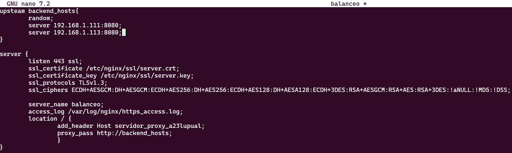
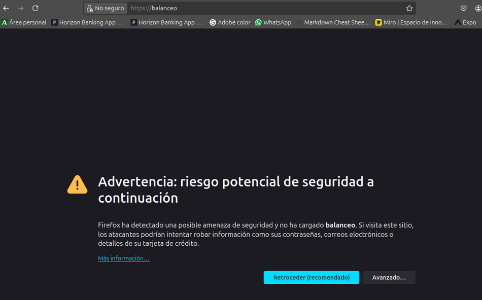
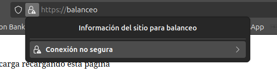
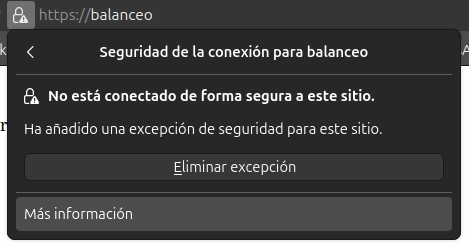
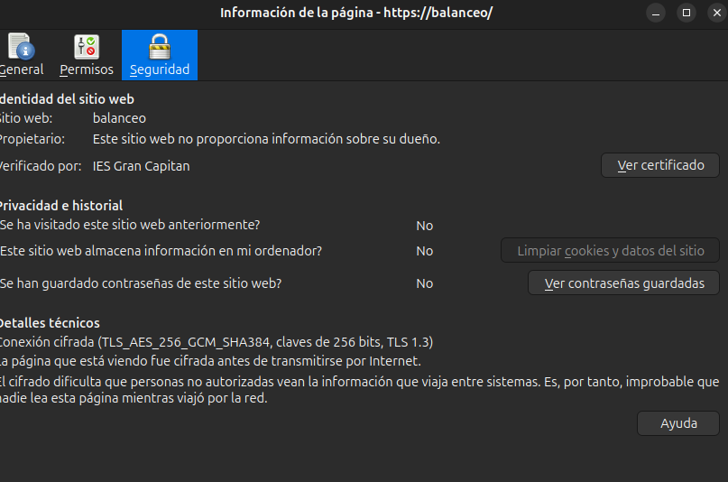
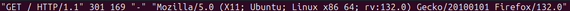
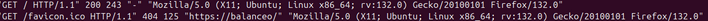

# Practica 2.5 - Proxy inverso y balanceo de carga con SSL en NGINX

## Introducción

Teniendo en cuenta en el escenario en el que nos encontramos, ahora mismo los propios servidores web lo cual aumenta la carga que tienen que tienen que soportar, para esto vamos a trasladar el cifrado el servidor proxy, se puede pensar que la comunicación entre el proxy y el servidor web puede ser insegura, pero esta comunicación se lleva a cabo en una red privada, lo cual la protege de cualquier ataque.

## Certificados

HTTPS se basa en el uso de certificados digitales, que resumiendo al entrar en una web se nos entrega un certificado mostrando quien es la página. 

Para comprobar dichos certificados deberemos acceder a la Autoridad de Certificación (CA). Los navegadores tienen precargadas las Autoridades de certificación en las que confían, por lo tanto si una web usa una diferentes a estas nos aparecerá un error diciendo que esta página no es segura.

## Tarea

Partiendo de la configuración exacta de la práctica anterior, en donde teníamos el servidor proxy de balanceo de carga y los dos servidores web.

Deberemos añadir la configuración SSL para el cifrado del proxy inverso, para cualquier solicitud distinta a los servidores web.

### Cración del certificado autofirmado

Nosotros no usaremos certificados de ninguna CA de confianza, ya que:

- Nuestra página no está publicada en internet.
- Y estos certificados son de pago.

Así que, crearemos nuestro propio certificado y lo firmaremos nosotros mismo como si fuésemos una CA auténtica.

Veamos, pues el proceso para generar los certificados y las claves asociadas a ellos (privada/pública). En primer lugar, debemos crear el siguiente directorio:
``/etc/nginx/ssl``.

Podemos crear los certificados con el siguiente comando:


- ``opnessl``: Es una herramienta por línea de comandos, que permite administras certificados, clave y otros archivos OpenSSL.
- ``req``: Este subcomando se utiliza para generar una solicitud de certificados y también solicitudes de firma de certificados (CSR).
- ``x509``: Este subcomando se utiliza para firmar, cifrar, descifrar, verificar y mostrar certificados.
- ``nodes``: Esto le dice a Openssl que no cifre la clave privada.
- ``days 365``: Esto le dice a Openssl que el certificado expirará en 365 días.
- ``newkey rsa:2048``: Esto le dice a Openssl que genere una nueva clave y certificado al mismo tiempo siendo, la clave RSA de 2048 bits.
- ``keyout``: Esto le dice a Openssl que el archivo de clave privada se llamará ``server.key``.
- ``out``: Esto le dice a Openssl que el archivo de certificado se llamará ``server.crt``.

### Configuración SSL del servidor proxy inverso

De la práctica anterior, dentro del directorio ``/etc/nginx/sites-availabe`` tenemos el archivo de configuración "balanceo". Es aquí donde realizaremos la configuración para que el acceso al sitio web se realice mediante SSL(HTTPS)

Es por esto dentro del bloque ``server{...}`` cambiaremos el puerto de escucha listen 80 por el siguiente bloque a continuación.



Donde estamos diciendo que:

- Escuche en el puerto 443 (Puerto por defecto de HTTPS).
- El directorio donde está el certificado que hemos generado.
- El directorio donde está la clave que hemos generado anteriormente.
- Los protocolos y tipos de cifrados que se pueden utilizar -> Estas son las versiones de protocolos y los tipos de cifrados considerados seguros a día de hoy.
- ``server_name`` Es el nombre del servidor.
- Y por último el archivo donde se guardan los logs de acceso.

### Comprobaciones



Para comprobar que los datos del certificado son correctos podemos comprobarlo así.

1. Pulsamos en el candado de la barra de búsqueda
   

2. Le damos a más información
   

3. Y por último, ver certificado:
   

1. Access los

- HTTP_ACCESS.log


- HTTPS_ACCESS.log


## Cuestiones finales

### Cuestión 1

-Hemos configurado nuestro proxy inverso con todo lo que nos hace falta pero no nos funciona y da un error del tipo This site can't provide a secure connection, ERR_SSL_PROTOCOL_ERROR.
Dentro de nuestro server block tenemos esto:

````bash
server {
listen 443;
ssl_certificate /etc/nginx/ssl/enrico-berlinguer/server.crt;
ssl_certificate_key /etc/nginx/ssl/enrico-berlinguer/server.key;
ssl_protocols TLSv1.3;
ssl_ciphers ECDH+AESGCM:DH+AESGCM:ECDH+AES256:DH+AES256:ECDH+AES128:DH+AES:ECDH+3DES:DH+3DES:RSA+AESGCM:RSA+AES:RSA+3DES:!aNULL:!MD5:!DSS;
server_name enrico-berlinguer;
access_log /var/log/nginx/https_access.log;

location / {
    proxy_pass http://red-party;
    }
}
````

Porque en la línea en la que pone ``listen 443`` no hemos añadido el parámetro ``ssl``. Por lo que debería ser ``listen 443 ssl``. Esto significa que ahora mismo no responde peticiones HTTPS.

### Cuestión 2

Imaginad que intentamos acceder a nuestro sitio web HTTPS y nos encontramos con el siguiente error:


Este error ocurre porque no estamos usando un certificado de una CA de confianza, por lo que el navegador nos muestra este error. Para solucionarlo deberemos añadir una excepción en el navegador o añadir una CA de confianza.

