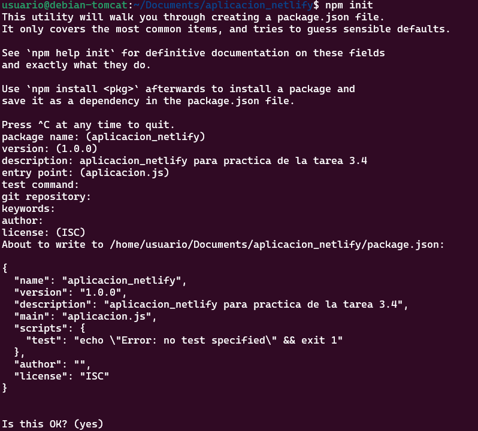
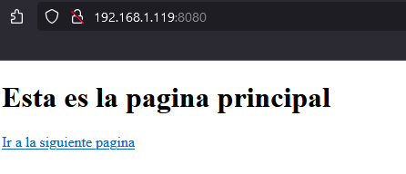
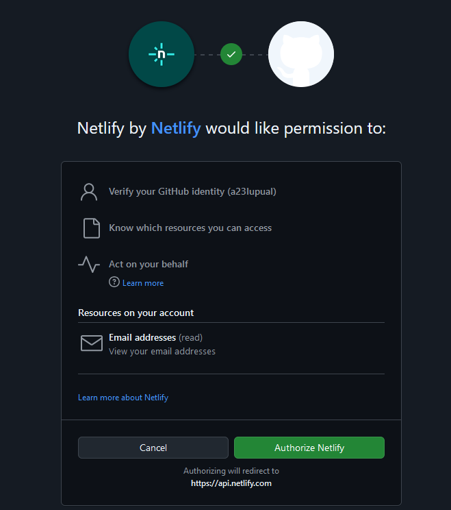

# Practica 3.4: Despliegue de una aplicacion React en Netlify

## Introducción 

En la practica anterior hemos desplegado, una aplicación en local para el desarrollo de la misma, pero en esta simularemos una situación más real en la que desplegamos una aplicación para producción, esto se puede hacer de dos maneras, copiando los archivos que teniamos en el servidor local y pegandolos en el hosting, o por otra parte, podemos usar GitHub mediante que hará esta trasmisión mediante ssh y una plataforma PaaS (Plataform as a Service) como Netlify para el despliegue a producción de una aplicación.

## ¿Qúe es GitHub?

GitHub es un servicio basado en la nube que aloja un sistema de control de versiones llamado Git. El cual permite subir cambios a los desarrolladores, a la vez que mantiene un seguimiento del progreso.

El control de versiones permite seguir un rastreo de los cambios que se realizan y ante un error, permite revertirlos para que no lleguen a producción.

## ¿Qué es Netlify?

Netligy es un proveedor de alojamiento en la nube que proporciona el backend sin servidores para sitios estáticos. Está diseñado para buscar la productividad en el frontend, para producir y probar rapidamente sitios web.

Funciona conectándose a un repositorio de GitHub, para descargar el cógigo fuente para la configuración del sitio, y poder prerenderizar los archivos del sitio.

Ventajas de Netlify:

- Hace que el despliegue sea muy sencillo con GitHub, GitLab o Bitbucket.
- Incorpora un servicio DNS.
- Podemos desplegar una sola rama, o probar otras con un Pull Request para ver el efecto en el sitio.
- Permite la previsualización.
- Permite el envio de formulaios para recoger información de los usuarios.

## Creación de nuestra aplicacion

Para crear nuestra aplicación estableceremos una conexion 'ssh' con nuestra máquina debian para crear un directorio en el que alojaremos la aplicación.


Dentro de este directorio crearemos tres archivos dos `.html` y un `.js` los que conformarán nuestra aplicación de ejemplo.

#### head.html

````html
<!DOCTYPE html>
<html>
<head>
        <title>Hola Mundo</title>
</head>
<body>

        <h1>Esta es la pagina principal</h1>

<p><a href="/tailPage">Ir a la siguiente pagina</a></p>


</body>
````

#### tail.html

````html
<!DOCTYPE html>
<html>
<head>
        <title>Hola Mundo</title>
</head>
<body>
        <h1>FUNCIONA</h1>

</body>
````

#### aplicacion.js

````js
var http = require('http');
var fs = require('fs'); // para obtener los datos del archivo html
var port = process.env.PORT || 8080; 

http.createServer(function (req, res) {
    res.writeHead(200, { 'Content-Type': 'text/html' });

    // req.url almacena el path o ruta de la URL
    var url = req.url;
    if (url === "/") {
// fs.readFile busca el archivo HTML
// el primer parámetro es el path al archivo HTML
// y el segundo es el callback de la función
// si el archivo no se encuentra, la función devuelve un error
// si el archivo se encuentra, el contenido del mismo se encuentra en pgres    
        fs.readFile("head.html", function (err, pgres) {
            if (err)
                res.write("HEAD.HTML NOT FOUND");
            else {
                // Las siguientes 3 lineas
                // tienen la función de enviar el archivo html
                // y finalizar el proceso de respuesta
                res.writeHead(200, { 'Content-Type': 'text/html' });
                res.write(pgres);
                res.end();
            }
        });
    }
    else if (url === "/tailPage") {
        fs.readFile("tail.html", function (err, pgres) {
            if (err)
                res.write("TAIL.HTML NOT FOUND");
            else {
                res.writeHead(200, { 'Content-Type': 'text/html' });
                res.write(pgres);
                res.end();
            }
        });
    }

}).listen(port, function () {
    console.log("SERVER STARTED PORT: 8080");
});
````

Igual que antes para crear nuestro servidor Node.js hacemos `npm init` para crear el archivo `package.json`.



Podemos comprobar el correcto funcionamiento con `node aplicacion.js`



De esta manera sabemos que nuestra aplicación funciona perfectamente y la podemos desplegar en sitios como AWS, GCP, Azure, Digital Ocean, Heroku...

DISCLAIMER¡¡¡¡ Para que nos funcione el Paas debemos hacer cambios dentro de el borrando todo lo que haya en el bloque de scripts y solamente dejar `"start":"node aplicacion.js"`


## Proceso de despliegue en Netlify

Para la aplicación de Netlify clonaremos el siguiente repositorio `https://github.com/StackAbuse/color-shades-generato`, el despliegue se realizará de dos maneras:

- Mediante el CLI de Netligy, es decir desde la terminal, desde un directorio local de nuestra máquina.

- Mediante un código publicado en un repositorio de GitHub.

### Despliegue mediante CLI

Primero deberemos de instalar el CLI de Netlify 


Despues debemos autenticarnos que se hará con el siguiente comando : `netlify login`
En este punto tendremos que tener la aplicación descargada, y estar logeados con Netlify, lo siguiente será preparar la aplicación para el despliegue.

Comenzamos instalando el `package.json` en el directorio de la aplicacion con el comando `npm install`, posteriormente realizamos el build con `npm run build`:


Una vez lo hemos instalado introducimos el comando `netlify deploy` el cual nos hará algunas preguntas las cuales dejaremos por defecto.


Y si todo ha ido correctamente nos saldrá el siguiente mensaje `If everything looks good on your draft URL, deploy it to your main site URL with the --prod flag.
netlify deploy --prod
`


### Despliegue mediante conexión con GitHub

Primero borraremos el site que hemos subido antes para evitar problemas


Y también eliminaremos el directorio que hemos creado antes `rm -rf directorio_repositorio` 

Esta vez nos vamso a descargar la aplicación con `wget` para que así no tenga ninguna relación con GitHub.

Una vez nos hemos descargado el .zip creamos una carpera nueva y descomprimos el archivo.


Tras esto inicializamos un repositorio git en el directorio que hayamos creado con el .zip.


Y solo nos queda hacer un push al repositorio que hemos creado antes para subir el contenido del commit


Con esto ya hemos subido a GitHub nuestra aplicación, el siguiente paso que nos queda es entrar en nuestro dashboard de Netlify para enlazar el repositorio de github con Netlify para poder hacer el despliegue.

Comenzamos importando como un proyecto existente en github


Autorizamos a Netlify con Github 



Y luego debemos seleccionar el proyecto que queramos subir, y si lo hemos hecho bien deberiamos acabar en la siguiente pestaña 


Por último terminamos la configuración del despliegue 


Y comenzará automáticamente el despliegue


De esta manera lo que hemos conseguido es que todos los `commit - push` que hagamos en gitHub resulte en un nuevo despliegue en netlify, que es lo conocido como despliegue continuo.

Comprobemos esto:

- Para esto haremos un cambio en el archivo `robots.txt` añadiendo en disallow /alberto_luque


- Tras esto haremos un nuevo `commit` y `push`.
- Y comprobaremos que etos cambios se han visto en Netlify.