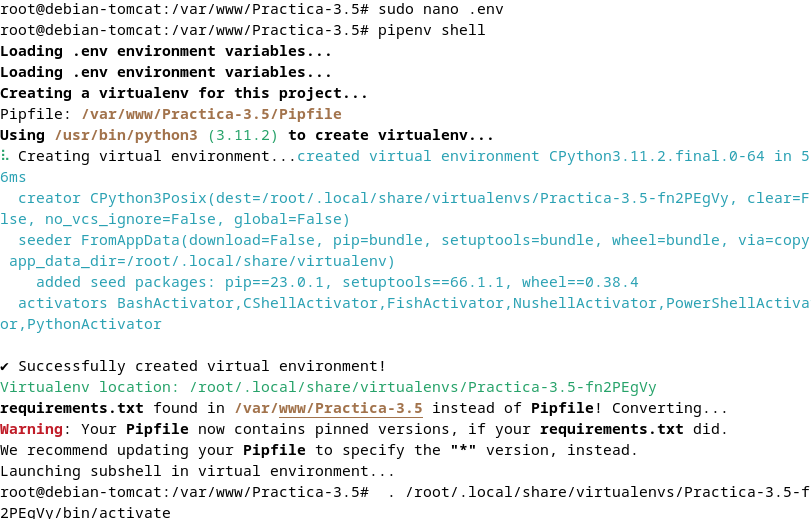
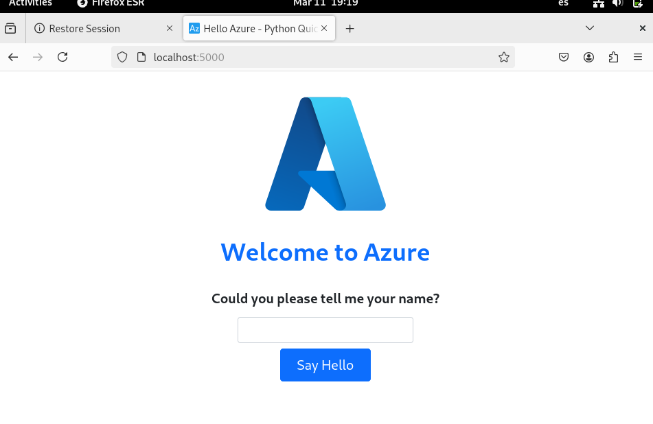

# Tarea 3.5: Despliegue de una aplicación Flask (Python)

## Prerequisitos

**Servidor Debian con los siguientes paquetes instalados:**

- Nginx
- Gunicorn
- Pipenv

Estas instalacioes se podrán hacer con `sudo apt install <paquete>`

## Introducción

### ¿Qué es un framework?

Un framework es un entorno de desarrollo que normalmente está especializado al lenguaje de programación que se está usando, en el caso de Python el más conocido es Django pero en nuestro caso usaremos, Flask ya que su curva de aprendizaje no es tan grande y se pueden hacer grandes aplicaciones, por otra parte para PHP tenemos Symphony, y para Ruby está Ruby on Rails.

### Flask

Hoy en dia hay muchas opciones para hacer aplicaciones web(PHP, JAVA), y en este caso Flask nos permite esto con Python.

Flask se dice que es un "micro" framework ya que en un principio solo se instalan las funcionalidades básicas para crear una página web, pero que se pueden añadir con plugins para Flask.

Flask utiliza el patron MVC (modelo - vista - controlador) este patron diferencia la base de datos o datos (modelo), del html (vista) y JavaScript y peticiones a BBDD (controlador).

### Gunicorn

Cuando se implenta una aplicación web basada en Python, se tienen estas tres piezas:

- Servidor web(Nginx, Apache).
- Servidor de aplicaciones WSGI(Gunicorn, uWSGI, mod_wsgi, Waitress).
- Aplicación Web(Django, Flask, Pyramid, FastAPI).

Los servidores web procesan y distribuyen las peticiones de navegadores y clientes, WSGI(Web Server Gateway Interface), proporcionan un conjunto de reglas y para el comportamiento y comunicación entre el servidor y las aplicaciones.

Gunicorn(Green Unicorn) es un servidor WSGI, que se encuentra entre el servidor web y su aplicación web. Este se encarga entre la comunicación entre estos traduciendo ordenes y peticiones.

## Gestor de paquetes `pip`

`pip` es el comando para instalar paquetes de Python, automatizando la conexión al sitio https://pypi.org/, descarga y la compilación del módulo.

### Entornos virtuales en Python

Un entorno virtual te permite tener múltiples instancias del interprete de Python, cada una configurada de diferente manera con distintos paquetes.

De esta manera nos permite instalar paquetes de forma local en un entorno con `pip`.

### Pipenv

Este permite crear y mantener un entorno virtual para tus proyectos, agregando/borrando paquetes desde Pipfile; generando el archivo `Pipfile.lock`.

## Procedimiento completo para el Despliegue

1. Instalamos el gestor de paquetes de Python


2. Instalamos el paquete `pipenv` para gestionar los entornos virtuales:


3. Y comprobamos que está isntalado correctamente mostrando su versión:

`pipenv --version`

4. Creamos el directorio en el que almacenaremos nuestro proyecto:


5. Al crearlo con `sudo`, los permisos pertenecen a root:


6. Hay que cambiarlo para que el dueño sea nuestro usuario (`nombre-debian`) y pertenezca al grupo `www-data`, el usuario usado por defecto por el servidor web para correr:


7. Estableceremos los permisos adecuados a este directorio, para que pueda ser leído todo el mundo:


8. Dentro del directorio de nuestra aplicación, creamos un archivo oculto `.env` que contendrá la variables de entorno necesarias:


9. Editamos el archivo y añadimos las variables, indicando cuál es el archivo `.py` de la aplicación y el entorno, que en nuestro caso será producción:


10. Inicamos ahora nuestro entrono virtual. `Pipenv` cargará las variables de entorno desde el fichero `.env` de forma automática:


11. Usamos `pipenv` para instalar las dependencias necesarias para nuestro proyecto:


12. Ahora para comprobar que nuestra aplicación funciona adecuadamente, crearemos la aplicación más secilla con Flask. El archivo con la aplicación será `application.py` y la que se encargará de iniciarla será `wsgi.py`:


13. Ahora comprobamos nuestra aplicación a modo de comprobación con el servidor Flask integrado.


14. Ahora podremos desde nuestra máquina anfitriona, introducir `http://IP-maq-virtual:5000`:


### Comprobación de Gunicorn

1. Comprobemos ahora que funciona Gunicorn funciona. Si ha funcionado con Flask con el siguiente comando podemos comprobar que funciona con Gunicorn.


2. Debemos comprobar con el comando `which gunicorn` cual es el path desde el que se ejecuta gunicorn:


3. Como ya tenemos Nginx lo iniciamos:


4. Ya fuera de nuestro entorno virtual, crearemos un archivo para que systemd corra Gunicorn como un servicio del sistema más:


5. Ahora habilitamos e iniciamos el servicio

``systemctl enable nombre_servicio``
``systemctl start nombre_servicio``

6. Creamos un archivo con el nombre de nuestra aplicación en el que se establecerá la configuración del sitio, por esto se encontrará en `/etc/nginx/sites-available/nombre_aplicacion`.


7. Ahora deberemos crear un enlace simbólico a `sites-enabled`:


8. Comprobamos la configuración de NGINX y comprobamos que el estado sea activo:


9. Ahora accederemos a nuestra página está siendo servida por Gunicorn y Nginx, por lo que necesitaremos editar el archivo `/etc/hosts` de nuestra máquina para que asocie la IP de la máquina a nuestro ``server_name``:

10. Por último deberemos comprobar que todo ha ido bien accediendo a nuestra página con `http://nombre_aplicacion` o `http://www.nombre_aplicacion`:

## Ejercicios

### Ejercicio 1

Repite todo el proceso con la aplicación del siguiente repositorio: ``https://github.com/raul-profesor/Practica-3.5``

Recuerda que deberás clonar el repositorio en tu directorio ``/var/www``:

git clone ``https://github.com/raul-profesor/Practica-3.5``

Y, tras activar el entorno virtual dentro del directorio del repositorio clonado, para instalar las dependencias del proyecto de la aplicación deberás hacer:

``pipenv install -r requirements.txt``

Y un último detalle, si miráis el código del proyecto, que es muy sencillo, veréis que Gunicorn debe iniciarse ahora así:

``gunicorn --workers 4 --bind 0.0.0.0:5000 wsgi:app``

Y el resto sería proceder tal y como hemos hecho en esta práctica.


1. Primero clonaremos el repositorio ``https://github.com/raul-profesor/Practica-3.5`` en la ruta ``/var/www`` con el siguiente comando:


2. Tras haber clonado el repositorio cambiaremos los permisos y grupos de estas carpetas para poder hacer modificaciones en las mismas.


3. Lo siguiente que deberemos hacer será crear el archivo .env para poder ejecutar el entorno virtual de Python en el cual escribiremos lo siguiente:

````bash
FLASK_APP = wsgi.py
FLASK_ENV = production
````
Y luego hay que hacer ```pipenv shell``` para activar el entorno virtual.



4. A continuación entraremos en él con cd Practica-3.5 y ejecutamos el siguiente comando

``pipenv install -r requirements.txt``

5. Tras que la instalación de dependencias del proyecto se descargue e instale correctamente deberemos proceder con la instalación de gunicorn.

``pipenv install gunicorn``

6. Antes de comenzar con la configuración de gunicorn vamos a comprobar que la página web funciona para eso ejecutaremos el comando.

``flask run --host '0.0.0.0'``

Y como podemos ver la web se ejecuta correctamente.



Una vez que sabemos que la página web se muestra correctamente probaremos con gunicorn para ver si también trabaja correctamente, ejecutando el comando, ``gunicorn --workers 4 --bind 0.0.0.0:5000 wsgi:app``


Tras esto deberemos averiguar y tomar nota de cuál es el path desde el cual se ejecuta gunicorn para configurar en unos pasos más adelante un servicio del sistema, con el comando ``which gunicorn``.


