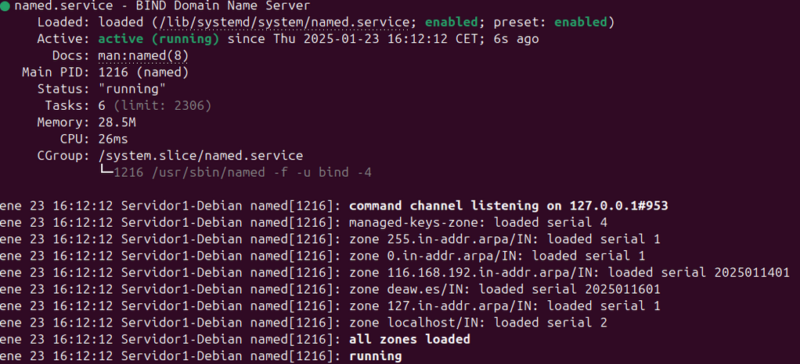

# Servidor DNS

## Que es un servidor DNS

Un servidor DNS es un servidor que se encarga de traducir las peticiones en texto plano a una dirección ip.

## Instalación de servidor DNS 

Bind es el estándar para servidores DNS. Es una herramienta de software libre que se puede usar en la mayoria de plataformas Unix y Linux conocido como named (name daemon).
Bind9 es la versión recomendada y es la que usaremos. Lo instalaremos de la siguiente manera:

``sudo apt-get install bind9 bind9utils bind9-doc``

## Configuración del servidor

Puesto que solo usaremos ``IPV4``, lo configuraremos en el directorio ``/etc/default``; y para indicarle qeu sólo use IPv4, modificamos la línea ``OPTIONS = "-u bind -4"``.

El archivo de configuración principal ``named.conf`` de Bind está en el directorio: ``/etc/bind``

Veremos esto:


Este archivo sirve para agrupar los archivos de configuración que usaremos. 

### Configuración *named.conf.options*

Es una buena práctica realizar copias de seguridad a los archivos de configuración cuando van a ser modificados.


Ahora editaremos el archivo ``named.conf.options`` que se encuentra en ```/etc/bind/`` e incluiremos lo siguiente:

- Por motivos de seguiridad añadiremos una lista de acceso para que sólo puedan hacer consultas recursivas aquellos hosts que permitamos.
    En nuestro caso, los confiables son los de la red 192.168.X.0/24 donde la 'X' dependerá de la red de casa. De esta forma tendremos que añadir algo así.


Esta inicialmente configurado para ser un servidor DNS caché. Y se guardarán las zonas en ``/var/cache/bind``

- Solo se permiten consultas recursivas a los hosts que hemos decidido en la lista de acceso.
- No permitir transferencias de zona a nadie.
- Configurar el servidor para que escuche las consultas DNS en el puerto 53. Se debe colocar la IP de la indterfaz de Debian.
- Permitir las consultas recursivas, ya que en el primer punto ya le hemos dichos que sólo puedan hacerlas los hosts de la ACL.
- Debemos comentar la línea en la que pone ``listen-on-v6 {any};`` puesto que no vamos a responder consultar IPv6.

El archivo nos deberia de quedar así:


Podemos comprobar si la configuracion es correcta con el comando ``sudo named-checkconf``.

Reiniciamos y comprobamos el servidor.


### Configuración *named.conf.local*

En este archvivo configuraremos aspectos relativos a nuestras zonas. Vamos a declarar la zona "deaw.es". Por ahora indicaremos que el servidor DNS es maestro para esta zona.


### Creación del archivo de zona

El archivo de zona es la parte específica de un espacio de nombres DNS que se hospeda en un servidor DNS. 
Vamos a crearlo justo en el directorio que hemos indicado antes y con el mismo nombre que hemos indicado antes.


El contenido del mimsmo será el siguiente:


Se debe personalizar el contenido para que incluyan las IPs propias.

Hay que tener en cuenta que los registros SOA son para detallar aspectos de la zona autoritativa, los NS para indicar los servidores DNS de la zona y los A las IPs respectivas.

### Creación del archivo de zona para la resolución inversa

Deben de existir ambos archivos uno de archivo de zona directa y otro para la inversa. 

En primer lugar debemos añadir las líneas correspondientes a esta zona inversa en el archivo ``named.conf.local``, igual que con el archivo de zona directa:


En la x debe ir el tercer bite de vuestra red.

Y la configuración de la zona de resolución inversa:


### Comprobación de las configuraciones

- Comprobación de la configuración de la zona directa:

``sudo named-checkzone db.deaw.es db.18.168.192``

- Comprobación de la configuración de zona indirecta:

``sudo named-checkzone db.18.168.192 db.deaw.es``

Sabremos que está bien ya que nos devolverá *``OK``*

Reiniciamos el servicio y comprbamos su estado:

``sudo systemctl restart named``



### Comprobaciones de las resoluciones y de las consultas

Vamos a comprobar desde los clientes con dig y nslooup:

- ``dig``


- ``nslooup``


### Cuestiones Finales

#### Cuestión 1

- *¿Qué pasará si un cliente de una red diferente a la tuya intenta hacer uso de tu DNS de alguna manera, le funcionará?¿Por qué, en qué parte de la configuración puede verse?*

No funcionará porque el servidor está configurado para aceptar consultas solo de la red interna (192.168.X.0/24).
Esto se controla mediante:
La lista de acceso (allow-query).
Las interfaces de escucha (listen-on).
La deshabilitación de IPv6 (listen-on-v6).


#### Cuestión 2

- *¿Por qué tenemos que permitir las consultas recursivas en la configuración?*

Permitir consultas recursivas a clientes internos ya que simplifica la resolución de nombres y mejora el rendimiento de la red.
Esto no es buena idea hacerlo de forma global ya que presenta devilidades de seguridad.

#### Cuestión 3

- *El servidor DNS que acabáis de montar, ¿es autoritativo?¿Por qué?*

Sí, el servidor DNS es autoritativo para las zonasconfiguradas explícitamente (deaw.es y X.168.192.in-addr.arpa) porque contiene los archivos de zona y responde como la fuente oficial para esos dominios.
También puede ser recursivo para los clientes internos confiables, resolviendo nombres de dominio fuera de sus zonas autoritativas, según tu configuración.

#### Cuestión 4

- *¿Dónde podemos encontrar la directiva $ORIGIN y para qué sirve?*

La directiva $ORIGIN se encuentra en los archivos de zona.
Sirve para definir o cambiar el dominio base al interpretar nombres relativos en los registros DNS.

#### Cuestión 5

- *¿Una zona es idéntico a un dominio?*

No una zona no es lo mismo que un dominio. Ya que una zona solo abarca una parte de un dominio.

#### Cuestión 6

- *¿Pueden editarse los archivos de zona de un servidor esclavo/secundario?*

No se pueden editar ya que los esclavos simplente reciben y almacenan los datos eniados de los maestros.

#### Cuestión 7

- *¿Por qué podría querer tener más de un servidor esclavo para una misma zona?*

Porque ayuda a mejorar la redundancia, redundancia, balanceo de carga y el rendimiento de la resolución de nombres.

#### Cuestión 8

- *¿Cuántos servidores raíz existen?*

Hay 13 servidores raíz en todo el mundo, pero que están replicados cientos de veces para mejorar la rapidez y redundancia en el funcionamiento.

#### Cuestión 9

- *¿Qué es una consulta iterativa de referencia?*

Es una consulta en la que el servidor DNS responde con la dirección IP de otro servidor DNS que puede tener la respuesta a la consulta del cliente.

#### Cuestión 10

- *En una resolución inversa, ¿a qué nombre se mapearía la dirección IP 172.16.34.56?*

Se mapearia para 56.24.16.172.in-addr.arpa