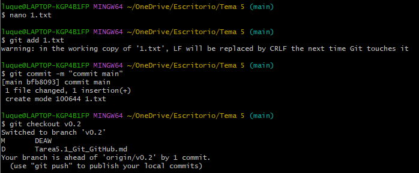
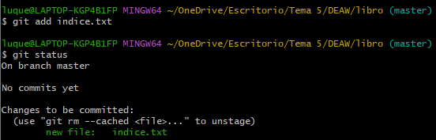
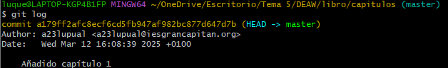

# Ejercicios Git y GitHub

### Repositorio DEAW

- 1. Crearemos un repositorio en GitHub llamado DEAW.


- 2. Clonaremos dicho repositorio en local.


## Commit inicial

- 1. Realizar un commit inicial con el comentario ``Comenzamos con los ejercicios de Git``


## Push inicial

1. SUbir los cambios al repositorio remoto.


## Ignorar archivos

- 1. Crear en el repositorio local un fichero llamado privado.txt.
- 2. Crear en el repositorio local una carpeta llamada privada.
- 3. Realizar los cambios oportunos para que tanto el archivo como la carpeta sean ingorados por git.


## Añadir fichero 1.txt

- 1. Añadir fichero 1.txt al repositorio local.


## Crear el tag v0.1

````githubexpressionlanguage
git tag V0.1
````


## Subir el tag v0.1

````githubexpressionlanguage
git push --tags
````


## Cuenta de github

1. Poner una foto de vuestro perfil de GitHub.
    - Para cambiar la foto de perfil deberemos ir a configuración de github y hacer click en cambiar foto


Y así queda la foto cambiada:


2. Poner el doble factor de autentificación en vuestra cuenta de Github

    - Para añadir el doble factor de autentificación deberemos irnos al apartado de contraseñas y autenticación, en donde añadiremos los métodos de autenticación de doble factor que queramos.

"

## Uso social de github

1. Preguntar los nombres de usuario de GitHub de 2 de tus compañeros de clase, búscalos, y síguelos.

- Buscamos los usuarios y le damos a seguir:


2. Seguir los repositorios DEAW del resto de tus compañeros.

- Dentro del repositorio, le daremos a watch all activity y ya estaremos siguiendo el repositorio


3. Añadir una estrella a los repositorios DEAW del resto de tus compañeros.

- Para dar una estrella haremos clic en star y así habremos dado una estrella


## Crear una tabla

1. Crear una tabla en markdown con la información de varios de tus compañeros de clase.


## Colaboradores

1. Poner a un compañero como colaborador en el repositorio DEAW

- Para añadir un colaborador deberemos ir a settings dentro del repositorio. Una vez dentro iremos a colaboradores y haremos clic en añadir personas


## Crear una rama v0.2

1. Crear una rama ``v0.2``.

- Para crear una rama nueva lo haremos con la siguiente rama

````githubexpressionlanguage
git branch v0.2
````

Posiciona tu carpeta de trabajo en esta rama, antes de esto hay que hacer commit de cualquier cambio.


## Añadir fichero 2.txt

1. Añadir fichero 2.txt en la rama ``v0.2``.


## Cramos la rama remota v0.2

1. Subir los cambios al repositorio remoto

- Para subir la rama v0.2 usaremos el siguiente comando.


## Merge directo

1. Posicionarse en la rama main

2. Hacer un merge de la rama v0.2 en la rama master


## Merge con conflicto

1. En la rama ``master`` poner Hola en el fichero ``1.txt`` y hacer commit



2. Posicionarse en la rama v0.2 y poner Adios en el fichero "1.txt" y hacer commit.


3. Posicionarse de nuevo en la rama master y hacer un merge con la rama v0.2

- Una vez que hemos hecho los cambios en cada rama hacemos un merge y nos indicara que hay un conflicto.


- Para resolverlo nos iremos al archivo y nos quedaremos con los cambios de la rama que queramos


- Una vez que hemos dejado el archivo con los cambios correctos y realizamos un commit


## Listado de ramas

1. Listar las ramas con merge y las ramas sin merge

- Para listar las ramas con merge usaremos el siguiente comando

````githubexpressionlanguage
git branch --merged
````

- Para listar las ramas sin merge usaremos el siguiente comando

````githubexpressionlanguage
git branch --no-merged
````
## Arreglar conflicto

- El conflicto fue arreglado en el paso anterior

## Borrar rama

1. Crear un tag v0.2
2. Borrar la rama v0.2


## Listado de cambios

1. Listar los distintos commits con sus ramas y sus tags.
- Para listar los cambios usaremos el comando:

````githubexpressionlanguage
git log --oneline --decorate --graph --all
````


## Ejercicios Git y Github II
## Ejercicios de creación y actualización de repositorios
### Ejercicio 1

1. Configurar Git definiendo el nombre del usuario, el correo electrónico y activar el coloreado de salida.

- Para configurar el nombre de usuario usaremos el comando:

````git config user.name nombre_usuario````

- Para configurar el email de usuario usaremos el comando:

````git config user.email email_usuario````

- Y por último configuraremos el coloreado de salida.

````git config color.ui auto````


### Ejercicio 2

1. Crear un repositorio nuevo con el nombre libro y mostrar su contenido
- Usaremos los siguientes comandos para crear el repositorio libro:
````githubexpressionlanguage
mkdir libro
cd libro
git init
````

- Para mostrar el contenido usaremos el comando:

````githubexpressionlanguage
ls -l
````


### Ejercicio 3

1. Comprobar el estado del repositorio.
- Como hemos podido ver en la anterior captura el repositorio está vacío
2. Crear un fichero indice.txt con el siguiente contenido:
````bash
touch indice.txt
````
2. Comprobar de nuevo el estado del repositorio.


4. Añadir el fichero a la zona de intercambio temporal.

````githubexpressionlanguage
git add indice.txt
````

5. Volver a comprobar el estado del repositorio.



### Ejercicio 4

1. Realizar un commit de los últimos cambios con el mensaje “Añadido índice del libro.” y ver el estado del repositorio.

````githubexpressionlanguage
git commit -m "Añadido índice del libro."
````
### Ejercicio 5

1. Cambiar el fichero indice.txt para que contenga lo siguiente:

2. Mostrar los cambios con respecto a la última versión guardada en el repositorio.


3. Hacer un commit de los cambios con el mensaje "Añadido capítulo 3 sobre gestión de ramas"


### Ejercicio 6

1. Mostrar los cambios de la última versión del repositorio con respecto a la anterior.

````git diff HEAD~1 HEAD````


2. Cambiar el mensaje del último commit por "Añadido capítulo 3 sobre gestión de ramas al índice"

````git commit --amend -m "Añadido capítulo 3 sobre gestión de ramas al índice."````

3. Volver a mostrar los últimos cambios del repositorio.

- Esto lo haremos con el mismo comando que en el primer apartado


## Ejercicios de manejo del historial de cambios
### Ejercicio 1

1. Mostrar el historial de cambios del repositorio.

- Para mostrar el historial de cambios del repositorio lo haremos con el siguiente comando

````git log````


2. Crear la carpeta capítulos y crear dentro de ella el fichero capitulo1.txt con el siguiente texto.

*El flujo de trabajo básico con Git consiste en: 1- Hacer cambios en el repositorio. 2- Añadir los cambios a la zona de intercambio temporal. 3- Hacer un commit de los cambios.*

3. Añadir los cambios a la zona de intercambio temporal.

````git add capitulo1.txt````

4. Hacer un commit de los cambios con el mensaje "Añadido capítulo 1." Volver a mostrar de cambios del repositorio.



### Ejercicio 2

1. Crear el fichero capitulo2.txt en la carpeta capítulos con el siguiente texto.

*El flujo de trabajo básico con Git consiste en: 1- Hacer cambios en el repositorio. 2- Añadir los cambios a la zona de intercambio temporal. 3- Hacer un commit de los cambios.*

2. Añadir los cambios a la zona de intercambio temporal.

````git add capitulo2.txt````

3. Hacer un commit de los cambios con el mensaje "Añadido capítulo 2.".

4. Mostrar las diferencias entre la última versión y dos versiones anteriores.

- Para mostrar las diferencias entre la última versión y dos versiones anteriores lo haremos con el siguiente comando:

````git diff HEAD~2 HEAD````


### Ejercicio 3

1. Crear el fichero capitulo3.txt en la carpeta capítulos con el siguiente texto.

G*it permite la creación de ramas lo que permite tener distintas versiones del mismo proyecto y trabajar de manera simultanea en ellas.*

2. Añadir los cambios a la zona de intercambio temporal.

````git add capitulo3.txt````

3. Hacer un commit de los cambios con el mensaje "Añadido capítulo 3.".

4. Mostrar las diferencias entre la primera y la última versión del repositorio.

- Para hacer esto necesitamos primero tenemos que saber el ID del primer commit:

````git log ````

- Y el ID que vemos a la izquierda es el ID de cada commit en este caso el número 1 es 4233f4b.

- Ahora hacemos la diferencia con este comando:

````git diff 4233f4b HEAD````


### Ejercicio 4

1. Añadir al final del fichero indice.txt la siguiente línea:

*Capítulo 5: Conceptos avanzados*

2. Añadir los cambios a la zona de intercambio temporal.

````git add indice.txt````

3. Hacer un commit de los cambios con el mensaje "Añadido capítulo 5 al índice."

4. Mostrar quién ha hecho cambios sobre el fichero indice.txt.

- Para mostrar quién ha hecho los cambios usaremos

````git blame indice.txt````


## Ejercicios de deshacer cambios
### Ejercicio 1

1. Eliminar la última línea del fichero indice.txt y guardarlo.
2. Comprobar el estado del repositorio


3. Deshacer los cambios realizados en el fichero indice.txt para volver a la versión anterior del fichero.

- Para deshacer los cambios usaremos el siguiente comando:

``git restore indice.txt``

4. Volver a comprobar el estado del repositorio.


### Ejercicio 2

1. Eliminar la última línea del fichero ````indice.txt``` y guradarlo.
2. Añadir los cambios a la zona de intercambio temporal.
3. Comprobar de nuevo el estado del repositorio.


4. Quitar los cambios de la zona de intercambio temporal, pero mantenerlos en el directorio de trabajo.
- Para quitar los cambios de la zona de intercambio, pero mantenerlos en el directorio de trabajo usaremos el siguiente comando:

``git reset indice.txt``

5. Comprobar de nuevo el estado del repositorio.


6. Deshacer los cambios realizados en el fichero indice.txt para volver a la versión anterior del fichero.
7. Volver a comprobar el estado del repositorio.


### Ejercicio 3

1. Eliminar la última línea del fichero indice.txt y guardarlo.
2. Eliminar el fichero capitulos/capitulo3.txt.
3. Añadir un fichero nuevo capitulos/capitulo4.txt vacío.
4. Añadir los cambios a la zona de intercambio temporal.
5. Comprobar de nuevo el estado del repositorio.
   
6. Quitar los cambios de la zona de intercambio temporal, pero mantenerlos en el directorio de trabajo.

- Para hacer esto usaremos los siguientes comandos:

````githubexpressionlanguage
git restore --staged indice.txt
git restore --staged capitulos/capitulo4.txt
git restore --staged capitulos/capitulo3.txt
````

7. Comprobar de nuevo el estado del repositorio.


8. Deshacer los cambios realizados para volver a la versión del repositorio.

- Aquí usaremos el mismo comando que en el apartado 6 pero sin la opción --staged. Y para deshacer los cambios del capitulo4 usaremos este comando.

````rm capitulos/capitulo4.txt````

9. Volver a comprobar el estado del repositorio.


### Ejercicio 4

1. Eliminar la última línea del fichero indice.txt y guardarlo.
2. Eliminar el fichero capitulos/capitulo3.txt.
3. Añadir los cambios a la zona de intercambio temporal y hacer un commit con el mensaje “Borrado accidental.”
4. Comprobar el historial del repositorio.


5. Deshacer el último commit pero mantener los cambios anteriores en el directorio de trabajo y la zona de intercambio temporal.

- Para mantener los cambios y borrar el commit, deberemos usar el siguiente comando:

````git reset --soft HEAD~1````

- El parámetro soft nos permite mantener los cambios y solo deshace el commit.

6. Comprobar el historial y el estado del repositorio.


7. Volver a hacer el commit con el mismo mensaje de antes.
8.Deshacer el último commit y los cambios anteriores del directorio de trabajo volviendo a la versión anterior del repositorio.

- Ahora usaremos el parámetro --harden vez de --soft para que el directorio vuelve a estar como el último commit antes de borrado accidental.

``git reset --hard HEAD~1``

9. Comprobar el historial y el estado del repositorio.


## Ejercicios de repositorios remotos
### Ejercicio 1

1. Crear un nuevo repositorio público en GitHub con el nombre libro-git.
2. Añadirlo al repositorio local del libro.
3. Mostrar todos los repositorios remotos configurados


### Ejercicio 2

1. Añadir los cambios del repositorio local al repositorio remoto de Github.
- Para submit los cambios a git deberemos usar el siguiente comando:

````git push -u origin master````

2. Acceder a Github y comprobar que se han subido los cambios mostrando el historial de versiones.

- Y como podemos ver, se han subido los cambios


### Ejercicio 3

1. Colaborar en el repositorio remoto libro-git de otro usuario.

2. Clonar su repositorio libro-git.
- Para clonar un repositorio usaremos git clone
3. Añadir el fichero autores.txt que contenga el nombre del usuario y su correo electrónico.

4. Añadir los cambios a la zona de intercambio temporal.

5. Hacer un commit con el mensaje “Añadido autor.”
6. Subir los cambios al repositorio remoto.
- Esta vez, como la rama en el remoto ya está creada obviaremos el parámetro -u en git push

``git push``


