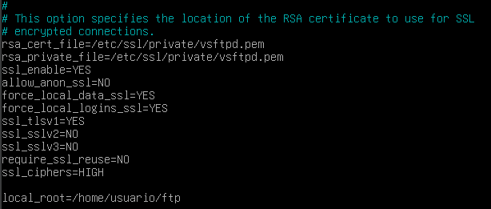

# SERVIDOR NGINX

## 1. Instalación serevidor web Nginx

Primero deberemos de actualizar los repositorios de nuestra máquina debian.

Esto se hace con el siguiente comando

`sudo apt update `

Y posteriormente tendremos que intalar nginx:

`sudo apt install nginx`

Para comprobar que la instalación se ha hecho de forma correcta y el servidor está activo introduciremos el siguiente comando

Y si vemos que el estado del servidor es `runing` es que la instalación se ha hecho de forma correcta.

## 2. Creacion de las carpetas del sitio web

Todos los archivos que se almacenen en nginx se almacenarán en un sistema de carpetas.
Todas estas se encontrarán en /var/www/; para esto vamos a crear una carpeta para nuestra web aquí.
 
 `sudo mkdir -p /var/www/nombre_web/html`

El nombre del dominio lo puedes elegir y dentro de la carpeta html tendrás que clonar el repositorio `https://github.com/cloudacademy/static-website-example` que será una página web de prueba para comprobar que funciona correctamente.

Además tendremos que cambiar los permisos para que el servidor pueda acceder a dicha carpeta para mostrarla.

Para cambiar el propietario:

`sudo chown -R www-data:www-data /var/www/nombre_web/html`

Y para cambiar los permisos:

`sudo chmod -R 755 /var/ww/nombre_web`

Si hemos hecho estos cambios al hacer `ls -la` deberia aparecer la carpeta con las siguientes propiedades:

Para comprobar que el servidor está funcionando introducimos en la máquina anfitriona `http://IP-maq-virtual` Esto lo sabremos con el comando `ip a`.

Deberiamos de ver algo asi:

## 2. Comprobaciones de servidor web NGINX

Hay dos rutas importantes una es `sites-available`, que contiene las rutas de los archivos de configuración de los hosts virtuales, decir todas las webs que alberga el servidor. La otra es `sites-enable` que contiene los archivos de los sitios habilitados. Dentro de esta se encuentra el archivo `default` la cual muestra la página abierta anteriormente.

Para que se muestre en contenido de nuestra web debemos modificar el archivo `/etc/nginx/sites-availables/nombre_web`. Con el comando:

`sudo nano /etc/nginx/sites-availables/vuestro_dominio`

E introducimos el siguiente bloque:

La ruta debe ser donde se encuentre el archivo index.html

Y creamos un enlace simbolico entre este archivo y el de los sitios que estan habilitados:

`sudo ln -s /etc/nginx/sites-available/nombre_web /etc/nginx/sites-enable`

Y reiniciamos el servidor 

`sudo systemctl restart nginx`

## 3. Comprobaciones

Como no poseemos un servidor DNS en el archivo `/etc/hosts` añadimos la línea `192.168.X.X nombre_web`.

## 4. FTP

### ¿Como transferir archivos desde nuestra máquina local/anfitrion a nuestra máquina virtual Debian/servidor remoto?

Principalmente hay dos métodos para hacer esta trasferencia de datos y archivos el más fácil que va a ser a través de git y la otra es mediante el protocolo FTP.
    El protocolo FTP no es seguro ya que la información no viaja de forma cifrada, pero en 2001 se introdujo el SFTP que la aplica una capa ssh al FTP.

### Configurar servidor SFTP DEBIAN 

Primero lo instalamos:

`sudo apt-get update`
`sudo apt-get intall vsftpd`

Ahora en el home creamos una carpeta llamada `/home/nombre_usuario/ftp`

Configuramos vsftpd para que este sea el directorio al cual vstpd cambia despues de conectarse.

Creamos los certificados para conectarnos:

En el siguiente archivo :

`sudo nano /etc/vsftpd.conf`

Borramos las siguientes líneas

`rsa_cert_file=/etc/ssl/certs/ssl-cert-snakeoil.pem`

`rsa_private_key_file=/etc/ssl/private/ssl-cert-snakeoil.key`

`ssl_enable=NO`

Y añadimos las siguientes

Por último usamos un cliente FTP como Filezilla para acceder a los archivos de nuestro servido nginx.

En el recuadro servidor introducimos la ip de la máquina debian, el nomber de usuario de la máquina la contraseña y el puerto que usaremos el 21.

## 1. Cuestion 1

Al no enlazar `sites-available` y `sites-enabled` mi página web no aparecerá como activa o enabled

## 2. Cuestion 2

Que nignx no tendrá permisos para poder mostrar los archivos que haya dentro.