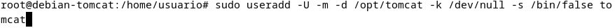
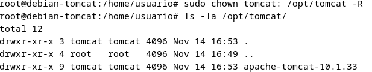

# PRACTICA 3.1.- INSTALACIÓN DE TOMCAT Y MAVEN PARA DESPLIEGUE DE APLICACIÓN JAVA

## 1. INTRODUCCIÓN

Para esta práctica necesitaremos una máquina virtual debian a poder ser con entorno gráfico en mi caso 
usaré una máquina Debian 12.

Una vez tengamos esta instalada y corriendo nos dispondremos a instalar tomcat que usaremos la versión 10 de tomcat.

## 2. INSTALACIÓN

Para la instalación de tomcat necesitaremos herramientas del sistema de los repositorios Debian y para esto actualizaremos los paquetes:

- Primero necesitaremos actualizar el sistema

- Despues instalar los paquetes que vamos a necesitar

Continuamos con la instalación de tomcat con el siguiente comando:

También podemos instalar esto mismo desde la página de tomcat [instalación tomcat](https://tomcat.apache.org/download-10.cgi).

### 2.1 Creacion del servicio tomcat

Para que podamos usar tomcat como un servicio deberemos comenzar con la creación de usuario la cual usará este.

Una vez que hemos creado este usuario debemos descomprimir lo que hemos instalado previamente en el directorio que le hemos asignado a tomcat en nuestro caso ``/opt/tomcat``.

Cuando tenemos el paso anterior debemos darle a esta carpeta los permisos al usuarios que hemos creado para tomcat con la siguiente línea.

Para facilitar la instalación y mantenimiento podemos cambiar el nombre de estos paquetes con el siguiente comando `mv </direccion/nombre-antiguio> </direccion/nombre-nuevo>`.

Creamos el archivo de unidad de Systemd:

Y en este mismo archivo escribiremos los siguiente:

Si lo hemos hecho todo bien iniciaremos el servicio `sudo systemctl start tomcat10`

Si nos vamos al navegador y buscamos lo siguiente `http://localhost:8080` nos debería aparecer una página como esta
 

## 3. FIREWALL

Si tenemos un firewall UFW en el sistema y queremos acceder desde la red tendremos que añadir una regla al puerto 8080/TCP

`sudo ufw allow 8080/tcp`

## 4. Configuración del sistema de administración de tomcat

Para esto comenzamos introduciendo el siguiente comando

Accedemos al archivo `/opt/tomcat/apache-tomcat/conf/tomcat-users.xml` y añadimos las siguienes líneas

Para esta práctica usaremos el usuario "usuario" y de contraseña "usuario"

