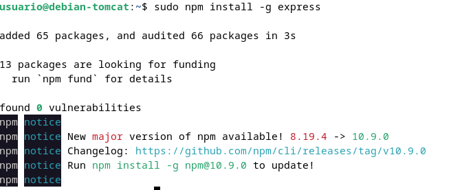
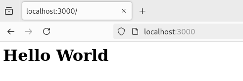

# Practica 3.2: Despliegue de aplicaciones con Node Express

## Introducción

Vamos a realizar el despligue de una aplicación Node.js, la diferencia que la aplicación no se despliega sobre un servidor si no que la aplicación es el servidor

## Instalación de Node.js, Express y test de la primera aplicación

Antes debemos comprobar que el servidor tomcat está apagado; primero comprobamos el estado con el comando `sudo systemctl status tomcat10` y si el estado es runnig lo paramos de la siguiente manera `sudo systemctl stop tomcat10`.

Primero comprobamos que los paquetes están actualizados con `sudo apt update` y `sudo apt upgrade`. Seguidamente añadimos la rama 16.x a la rama del repositorio de Node.js


Y despues simplemente instalamos Node.js con el siguiente comando


## Instalación de ExpressJS 

Ahora instalamos Express.js y para hacerlo de forma global introducimos el siguiente comando



Con esta serie de comandos crearemos un archivo e inicializaremos un proyecto Node.js con express.js


Creamos el fichero `app.js` e introducimos el siguiente código de javaScript

```js
const express = require('express')
const app = express()
const port = 3000

app.get('/', (req, res) => {
    res.send('Hello. Welcome to this blog')
})

app.listen(port, () => {
    console.log(`Example app listening at http://localhost:${port}`)
})
```

Y por último para comprobar la correcta instalación iniciamos el servidor con `node app.js` y deberiamos ver algo así:


También tenemos que poder acceder a este servidor desde nuestra máuqina local con `http://ip-maqina:3000`

## Despliegue de una nueva aplicacion

Para practicar el despliegue de aplicaciones de terceros lo haremos de una aplicación de un repositorio github.

Primero clonamos dicho repositorio

`git clone https://github.com/MehedilslamRipon/Shopping-Cart-Application`


Instalamos npm en este proyecto `npm install`, e iniciamos la aplicaion `npm run start`:

Nos aparecerá el siguiente error `sh: 1: nodemon: not found` y esto es porque no teneos instalado nodemon de forma local en el proyecto y con 


Y con esto ya deberia funcionar nuestro proyecto



## Cuestiones

Cuando ejecutáis el comando npm run start, lo que estáis haciendo es ejecutar un script:

- ¿Donde podemos ver que script se está ejecutando?
El script que se ejecuta con npm run start está definido en el archivo package.json del proyecto, dentro de la sección "scripts"

- ¿Qué comando está ejecutando?

El comando que se ejecuta es el valor que se encuentra en la sección "start" dentro del objeto "scripts" en package.json.
