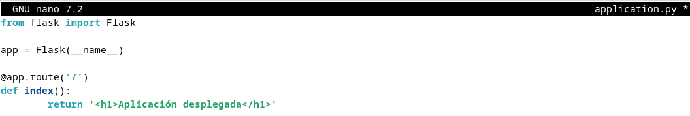
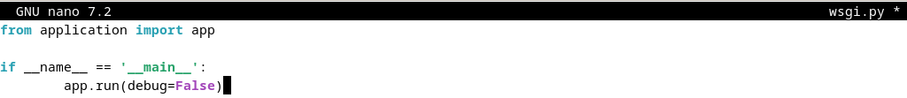

# Tarea 3.5: Despliegue de una aplicación Flask (Python)

## Prerequisitos

**Servidor Debian con los siguientes paquetes instalados:**

- Nginx
- Gunicorn
- Pipenv

Estas instalacioes se podrán hacer con `sudo apt install <paquete>`

## Introducción

### ¿Qué es un framework?

Un framework es un entorno de desarrollo que normalmente está especializado al lenguaje de programación que se está usando, en el caso de Python el más conocido es Django pero en nuestro caso usaremos, Flask ya que su curva de aprendizaje no es tan grande y se pueden hacer grandes aplicaciones, por otra parte para PHP tenemos Symphony, y para Ruby está Ruby on Rails.

### Flask

Hoy en dia hay muchas opciones para hacer aplicaciones web(PHP, JAVA), y en este caso Flask nos permite esto con Python.

Flask se dice que es un "micro" framework ya que en un principio solo se instalan las funcionalidades básicas para crear una página web, pero que se pueden añadir con plugins para Flask.

Flask utiliza el patron MVC (modelo - vista - controlador) este patron diferencia la base de datos o datos (modelo), del html (vista) y JavaScript y peticiones a BBDD (controlador).

### Gunicorn

Cuando se implenta una aplicación web basada en Python, se tienen estas tres piezas:

- Servidor web(Nginx, Apache).
- Servidor de aplicaciones WSGI(Gunicorn, uWSGI, mod_wsgi, Waitress).
- Aplicación Web(Django, Flask, Pyramid, FastAPI).

Los servidores web procesan y distribuyen las peticiones de navegadores y clientes, WSGI(Web Server Gateway Interface), proporcionan un conjunto de reglas y para el comportamiento y comunicación entre el servidor y las aplicaciones.

Gunicorn(Green Unicorn) es un servidor WSGI, que se encuentra entre el servidor web y su aplicación web. Este se encarga entre la comunicación entre estos traduciendo ordenes y peticiones.

## Gestor de paquetes `pip`

`pip` es el comando para instalar paquetes de Python, automatizando la conexión al sitio https://pypi.org/, descarga y la compilación del módulo.

### Entornos virtuales en Python

Un entorno virtual te permite tener múltiples instancias del interprete de Python, cada una configurada de diferente manera con distintos paquetes.

De esta manera nos permite instalar paquetes de forma local en un entorno con `pip`.

### Pipenv

Este permite crear y mantener un entorno virtual para tus proyectos, agregando/borrando paquetes desde Pipfile; generando el archivo `Pipfile.lock`.

## Procedimiento completo para el Despliegue

1. Instalamos el gestor de paquetes de Python

2. Instalamos el paquete `pipenv` para gestionar los entornos virtuales:

3. Y comprobamos que está isntalado correctamente mostrando su versión:

`pipenv --version`

4. Creamos el directorio en el que almacenaremos nuestro proyecto:

5. Al crearlo con `sudo`, los permisos pertenecen a root:

6. Hay que cambiarlo para que el dueño sea nuestro usuario (`nombre-debian`) y pertenezca al grupo `www-data`, el usuario usado por defecto por el servidor web para correr:

7. Estableceremos los permisos adecuados a este directorio, para que pueda ser leído todo el mundo:

8. Dentro del directorio de nuestra aplicación, creamos un archivo oculto `.env` que contendrá la variables de entorno necesarias:

9. Editamos el archivo y añadimos las variables, indicando cuál es el archivo `.py` de la aplicación y el entorno, que en nuestro caso será producción:

10. Inicamos ahora nuestro entrono virtual. `Pipenv` cargará las variables de entorno desde el fichero `.env` de forma automática:

11. Usamos `pipenv` para instalar las dependencias necesarias para nuestro proyecto:

12. Ahora para comprobar que nuestra aplicación funciona adecuadamente, crearemos la aplicación más secilla con Flask. El archivo con la aplicación será `application.py` y la que se encargará de iniciarla será `wsgi.py`:

13. Ahora comprobamos nuestra aplicación a modo de comprobación con el servidor Flask integrado.

14. Ahora podremos desde nuestra máquina anfitriona, introducir `http://IP-maq-virtual:5000`:

### Comprobación de Gunicorn

1. Comprobemos ahora que funciona Gunicorn funciona. Si ha funcionado con Flask con el siguiente comando podemos comprobar que funciona con Gunicorn.

2. Debemos comprobar con el comando `which gunicorn` cual es el path desde el que se ejecuta gunicorn:

3. Como ya tenemos Nginx lo iniciamos:

4. Ya fuera de nuestro entorno virtual, crearemos un archivo para que systemd corra Gunicorn como un servicio del sistema más:

5. Ahora habilitamos y 

