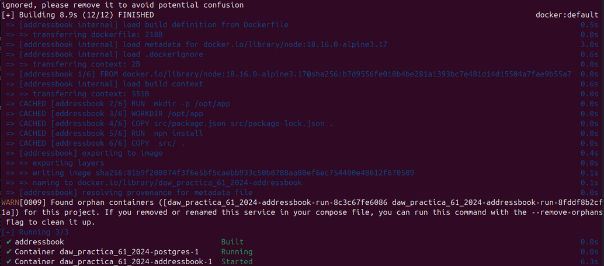
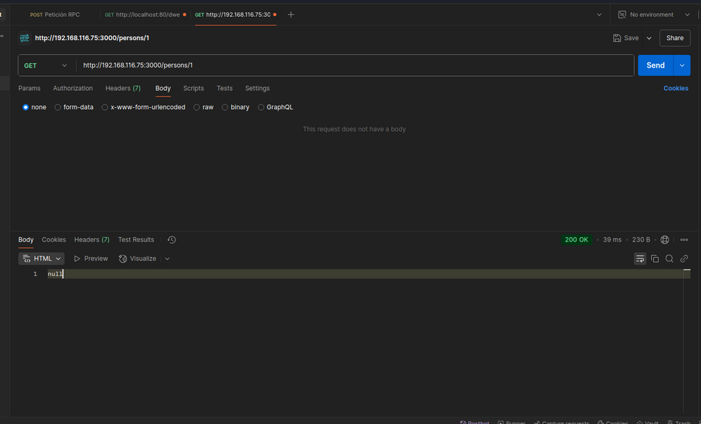

# Práctica 6.1 - Dockerización del despliegue de una aplicación Node.js

## Introducción

En esta practica vamos a dockerizar una aplicación que hace peticiónes a una API para gestionar direcciones que guardará los datos en una BBDD PostgreSQL.

## Ventajas de Dockerizar

1. Configuración rápida del entrono local para el desarrollo.

2. Evitar una inconsistencia en la configuración de entronos.

3. Despliegues rápidos.

4. Mejor control de versiones.

5. Al tener control de versiones se puede hacer rollback al código.

6. Como se suele hacer, se establece un entrono local, de integración, de puesta en escena y de producción.

7. Hay un gran apoyo de la comunidad implementando con grandes imagenes que se pueden reutilizar.

## Despliegue con Docker

## Clonar el repositorio que usaremos:

````
$ git clone https://github.com/raul-profesor/DAW_practica_6.1_2024.git
````

Este es el contenido del archivo ``Dockerfile``, para poder construir la imagen y correr el contenedor.

````
_____ node:18.16.0-alpine3.17 

_____  mkdir -p /opt/app

_____ /opt/app

_____ src/package.json src/package-lock.json .

_____ npm install

_____ src/ .

_____ 3000

_____ ["npm", "run", "start:dev"]

````

Cada línea es un comando que docker va a ejecutar para la construcción del contenedor.

De esta manera para tener nuestra aplicación corriendo simplemente serán un par de comandos.

Hacemos un build de la imagen de Docker. Le indicamos que ésta se llama ``librodirecciones`` y que haga build con el contexto del directorio de trabajo, así como del Dockerfile que hay en el:

``$ docker build -t librodirecciones .``

Y solo nos quedaría iniciar el contenerdor con la aplicación. Necesatiaremos especificar las opciones ``-p``, mediante le diremos que escuche peticiones de cualquier máquina desde el peusto 3000 (``-p 3000:3000``), y también la opción ``-d`` que lo haremos correr en background. Así quedaría el comando:

```$ docker run -p 3000:3000 -d librodirecciones```


Solamente nos quedaría comproba el contendedor con ``http://IP_Maq_Virtual:3000``.


## Docker Compose

Docker compose nos permite:

- Iniciar y detener múltiples contenedores en secuencia.
- Conectar contenedores utilizando una red virtual.
- Manejar la persistencia de datos usando Docker Volumes.
- Establecer variables de entorno.
- Construir o descargar imágenes de contenedores según sea necesario.

Docker compose usa un archivo ``yaml`` para escribir la configuración de la aplicación.

En este caso nosotros usaremos este archivo ``yaml`` para el correcto funcionamiento de nuestra aplicación.

````yaml
version: "3.9"
services:
  postgres:
    image: postgres:latest
    environment:
      POSTGRES_USER: postgres
      POSTGRES_PASSWORD: postgres
    ports: 
      - '5432:5432'
    volumes:
      - addressbook-db:/var/lib/postgresql/data

  addressbook:
    build:
      context: .
    environment:
      DB_SCHEMA: postgres
      DB_USER: postgres
      DB_PASSWORD: postgres
      DB_HOST: postgres
    depends_on:
      - postgres
    ports:
      - '3000:3000'

volumes:
  addressbook-db:
````

Para iniciar los contenedores con Docker Compose, simplemente ejecutamos el siguiente comando:

``docker compose run addressbook npm run migrate``


Ahora vamos a construir los contenedores a partir de las imágenes:

````docker compose up --build -d````



Y como se puede observar el contenedor ya está funcionando y se puede acceder a él.

## Tarea

Probad que la aplicación junto con la BBDD funciona correctamente. El funcionamiento de la API es:

- GET /persons/all muestra todas las personas en el libro de direcciones
- GET /persons/1 muestra la persona con el id 1
- PUT /persons/ añade una persona al libro de direcciones
- DELETE /persons/1 elimina a la persona con el id 1

1. Función put:
   Como podemos ver, después de hacer el put, la aplicación nos devuelve los datos que hemos introducido en la base de datos junto al código 200 indicando que se han insertado correctamente.


2. Función GET /persons/1
   En este caso la aplicación nos devuelve la información de la persona con ID 1


3. Función GET /persons/all
   Aquí la aplicación nos devuelve todas las personas que hay en la base de datos.


4. Y por último DELETE /persons/1

   Esta petición como su nombre indica borrar a la persona con ID 1
   Y si volvemos a intentar acceder a la persona 1 podemos ver que devuelve null, indicando que se ha borrado exitosamente. 


